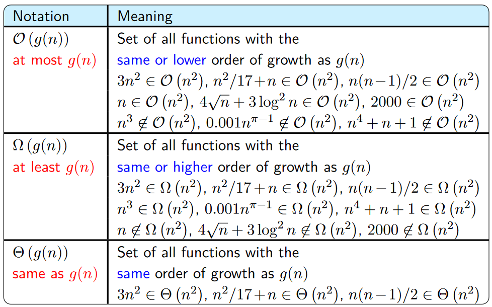

# Notes

### What is an algorithm?
- A step by step procedure to solve a problem in a finite set of time

## Algorithm vs Program
- Algorithm ; Program
- Design ;  Implementation
- Domain Knowledge ; Programmer
- Any Language ; Programming Language
- H/w and OS independent ; H/w and OS dependent
- Analyze ; Testing

## Priori Analysis
1. Algorithm
2. Independent of language
3. Hardware Independent
4. Time and Space Function

## Posteriori Testing
1. Program
2. Language dependent
3. Hardware dependent
4. watch time and bytes

## What makes up an Algorithm
1. Zero or more <span style="text-decoration: underline;">__Inputs__</span>
2. Returns at least one <span style="text-decoration: underline;">__Output__</span>
3. Every statement should have <span style="text-decoration: underline;">__Definiteness__</span>
4. The set of statements is <span style="text-decoration: underline;">__Finite__</span>
5. <span style="text-decoration: underline;">__Effectiveness__</span>

#  How to Analyze an Algorithm
```
Algorithm swap(a, b) {
    temp <- a;
    a <- b;
    b <- temp;
}
```
1. Time
2. Space
3. Network Comsuption
4. Power Consumption
5. CPU Registers Consumption
6. ... etc

### Time analysis
```
temp <- a; ----> 1
a <- b;    ----> 1 
b <- temp; ----> 1
Thus f(n) = 3 unit of time
```
- Analysis can have varying level of detail
```
x <- 5*a+6*b
One assignment
Two multiplication
One addition

Thus f(n) = 4 unit of time
```
- The statement above f(n) = 4 or f(n) = 1. It depends on how presise the analysis must be. Since the result is constant, it can be represented as <span style="text-decoration: underline;">__O(1)__</span>. 

### Space analysis
```
a    ---> 1
b    ---> 1
temp ---> 1

Thus s(n) = 3 word
```
Since the result is constant, it can be represented as <span style="text-decoration: underline;">__O(1)__</span>. 

# Frequency Count Method
Consider this algorithm:
```
let a = an array of size n
Alorithm Sum(A,n) {
    s <- 0;
    for(i=0;i<n;i++){
        s <- s+A[i]; 
    }
    return s;
}
```
Using the Frequency Count Method:
```
s<-0 -------> 1
i<-0 -------> 1   }
i<n  -------> n+1 } ----> n+1 or 2n+2
i++  -------> n   }
s<-s+A[i] --> n
return s ---> 1

Thus f(n) = 2n + 3
```
Since f(n) is degree one it can be represented as <span style="text-decoration: underline;">__O(n)__</span>. 

```
A -- n
n -- 1
s -- 1
i -- 1

Thus S(n) = n + 3
```
Since S(n) is degree one it can be represented as <span style="text-decoration: underline;">__O(n)__</span>. 

### Two Dimensional Array
```
let A and B = 2d Arrays the size of n x n
Algorithm Add(A, B, n){         
    for(i=0; i<n; i++){             ---------- n+1
        for(j=0; i<n; j++){         ---------- n * n+1
            c[i,j] = A[i,j]+B[i,j]; ---------- n * n
        }
    }
}

Thus f(n) = 2n^2 + 2n + 1
```
Since f(n) is degree two it can be represented as <span style="text-decoration: underline;">__O(n^2)__</span>. 
```
A --- n^2
B --- n^2
C --- n^2
n --- 1
i --- 1
j --- 1

Thus S(n) = 3n^2 + 3
```
Since S(n) is degree two it can be represented as <span style="text-decoration: underline;">__O(n^2)__</span>. 

### Multiplication of Two Matrices
```
let A and B = 2d Arrays the size of n x n
Algorithm Multiply (A, B, n) {
    for(i =0 ; i < n; i++) {                         --- n+1
        for (j = 0; j < n; j++) {                    --- n * (n+1)
            c[i,j] = 0;                              --- n * n      
            for(k = 0; k<n; k++){                    --- n * n * (n+1)
                c[i,j] = c[i, j] + A[i,k] * B[k, j]; --- n * n * n
            }
        }
    }
}

Thus f(n) = 2n^3 + 3n^2 + 2n + 1
```
Since f(n) is degree three it can be represented as <span style="text-decoration: underline;">__O(n^3)__</span>. 
```
A --- n^2
B --- n^2
C --- n^2
n --- 1
i --- 1
j --- 1
k --- 1

Thus S(n) = 3n^2 + 4
```
Since S(n) is degree two it can be represented as <span style="text-decoration: underline;">__O(n^2)__</span>. 

# Time Complexity

- Ex 1:
```
for(i=0; i<n; i++) { ---n+1
    stmt; -------------- n
}
__________
O(n)
```

### What is a data structure?
- A systematic way of storing, organizing, modifying, and accessing data


## Why learn algorithms?
- Understand how computers see the world
- In designing software, the part that takes the longest is design. Algorithms will focus alot on design and train your design skills. 

### How to measure the goodness of an algorithm?
- Correctness
- Run time
- Space-efficiency
- Clarity
- Functionality
- Modularity
- ...

### Complexity analysis
- Run time depends on :
- Algorithm 
- Input size
- Input data distribution
- ...
- Analyze the run time using Asymptotic analysis


## Basic operation takes constant time
- Arithmetic operation
- Comparison operation
- Memory operation
- Function invocation and return

### Case analysis
- Worst-case complexity Tworst(n): Input of size n that takes the longest time amoung all other inputs
- Best-case complexity Tbest(n): Input of size n that takes the shortest time amoung all other inputs
- Average-case complexity Tavg(n): Complexity for a typical/random input of size n

## Asymptotic notation

