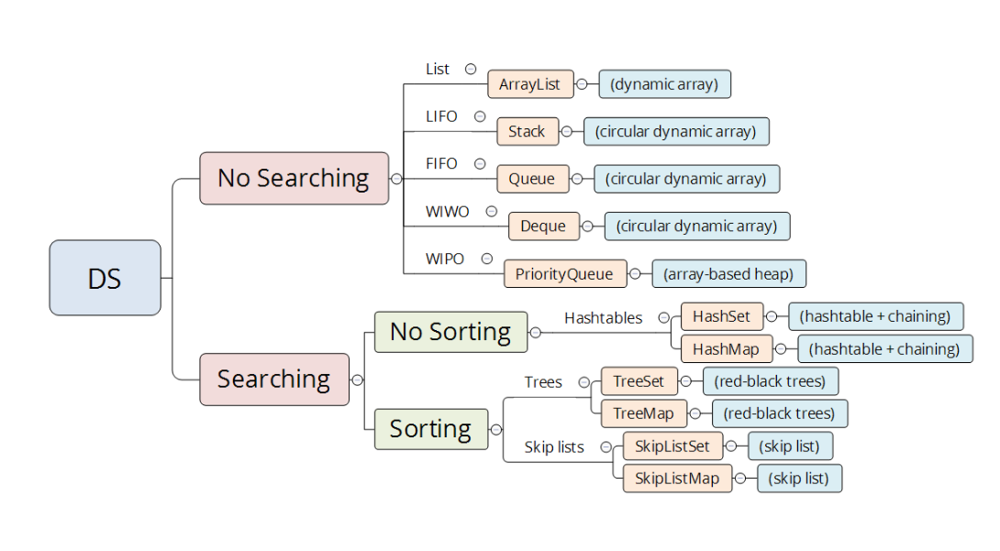
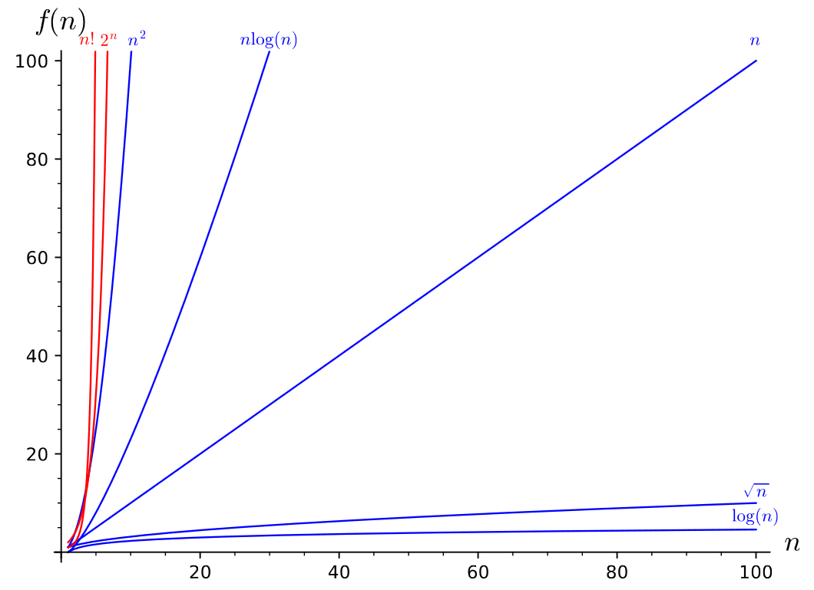

# Notes

### What is an algorithm?
- A step by step procedure to solve a problem in a finite set of time

### What is a data structure?
- A systematic way of storing, organizing, modifying, and accessing data

## Why learn algorithms?
- Understand how computers see the world
- In designing software, the part that takes the longest is design. Algorithms will focus alot on design and train your design skills. 

### How to measure the goodness of an algorithm?
- Correctness
- Run time
- Space-efficiency
- Clarity
- Functionality
- Modularity
- ...

### Complexity analysis
- Run time depends on :
- Algorithm 
- Input size
- Input data distribution
- ...
- Analyze the run time using Asymptotic analysis

## Basic operation takes constant time
- Arithmetic operation
- Comparison operation
- Memory operation
- Function invocation and return